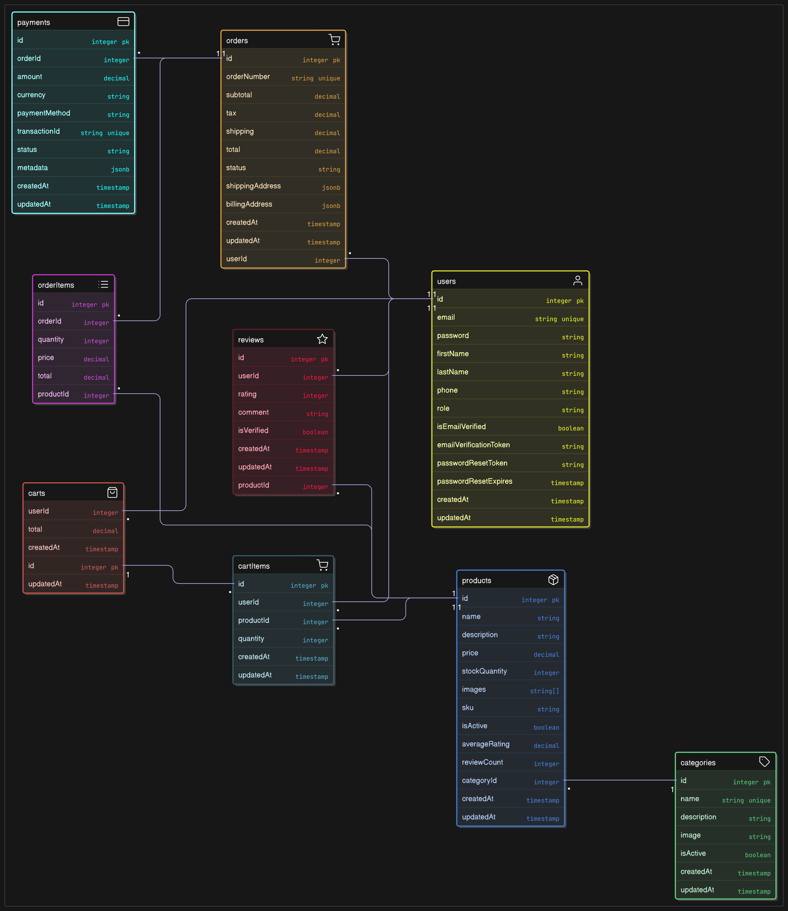

# E-Commerce Backend API

A comprehensive e-commerce backend built with NestJS, PostgreSQL, and modern best practices. This system provides a complete solution for online retail operations including user management, product catalog, order processing, and payment integration.

## 🚀 Features

### User Management
- User registration and authentication
- JWT-based authorization
- Role-based access control (Admin/Customer)
- Password encryption with bcrypt
- Profile management
- Email verification

### Product Management
- Product CRUD operations
- Category management
- Image upload and management
- Stock tracking
- Search and filtering
- Product reviews and ratings

### Order Management
- Shopping cart functionality
- Order placement and tracking
- Order status management
- Order history
- Invoice generation

### Payment Processing
- Multiple payment gateway integration (Stripe, PayPal)
- Secure payment processing
- Payment verification
- Refund management

### Admin Features
- Dashboard with analytics
- User management
- Product management
- Order management
- Sales reports
- Inventory tracking

## 🛠 Tech Stack

- **Framework**: NestJS
- **Database**: PostgreSQL
- **ORM**: TypeORM
- **Authentication**: JWT
- **File Upload**: Multer
- **Validation**: class-validator
- **Documentation**: Swagger/OpenAPI
- **Testing**: Jest
- **Docker**: Containerization support

## 📋 Prerequisites

- Node.js (v16 or higher)
- PostgreSQL (v12 or higher)
- npm or yarn
- Docker (optional)

## 🚀 Installation

### Using npm
```bash
# Clone the repository
git clone https://github.com/Daniel-Kav/nest-js-ecommerce
cd ecommerce-backend

# Install dependencies
npm install

# Copy environment variables
cp .env.example .env

# Configure your database and other settings in .env
```

### Using Docker
```bash
# Clone the repository
git clone https://github.com/Daniel-Kav/nest-js-ecommerce
cd ecommerce-backend

# Build and run with Docker Compose
docker-compose up -d
```

## ⚙️ Environment Variables

Create a `.env` file in the root directory:

```env
# Database
DATABASE_HOST=localhost
DATABASE_PORT=5432
DATABASE_USERNAME=postgres
DATABASE_PASSWORD=password
DATABASE_NAME=ecommerce_db

# JWT
JWT_SECRET=your-super-secret-jwt-key
JWT_EXPIRATION=24h

# File Upload
UPLOAD_DEST=./uploads
MAX_FILE_SIZE=5242880

# Payment Gateways
STRIPE_SECRET_KEY=sk_test_...
STRIPE_WEBHOOK_SECRET=whsec_...
PAYPAL_CLIENT_ID=your-paypal-client-id
PAYPAL_CLIENT_SECRET=your-paypal-client-secret

# Email
SMTP_HOST=smtp.gmail.com
SMTP_PORT=587
SMTP_USER=your-email@gmail.com
SMTP_PASS=your-app-password

# Redis (for caching)
REDIS_HOST=localhost
REDIS_PORT=6379

# Application
PORT=3000
NODE_ENV=development
```

## 🗄️ Database Setup

```bash
# Run migrations
npm run migration:run

# Seed initial data
npm run seed

# Generate new migration
npm run migration:generate -- -n MigrationName
```

## 🏃‍♂️ Running the Application

```bash
# Development
npm run start:dev

# Production
npm run build
npm run start:prod

# Debug mode
npm run start:debug
```

## 📚 API Documentation

Once the application is running, you can access:

- **Swagger UI**: http://localhost:3000/api/docs
- **API JSON**: http://localhost:3000/api/docs-json

## 🧪 Testing

```bash
# Unit tests
npm run test

# E2E tests
npm run test:e2e

# Test coverage
npm run test:cov

# Watch mode
npm run test:watch
```

## 📁 Project Structure

```
src/
├── auth/                 # Authentication module
├── users/               # User management
├── products/            # Product management
├── categories/          # Category management
├── orders/              # Order management
├── payments/            # Payment processing
├── cart/                # Shopping cart
├── reviews/             # Product reviews
├── common/              # Shared utilities
│   ├── decorators/      # Custom decorators
│   ├── filters/         # Exception filters
│   ├── guards/          # Auth guards
│   ├── interceptors/    # Request/Response interceptors
│   └── pipes/           # Validation pipes
├── config/              # Configuration files
├── database/            # Database configuration
│   ├── migrations/      # Database migrations
│   └── seeds/           # Database seeders
└── uploads/             # File uploads directory
```

## 🔐 Authentication & Authorization

### Authentication Flow
1. User registers/logs in
2. Server returns JWT token
3. Client includes token in Authorization header
4. Server validates token for protected routes

### Roles
- **ADMIN**: Full system access
- **CUSTOMER**: Limited to customer operations

### Protected Routes
Use the `@UseGuards(JwtAuthGuard)` decorator for authentication and `@Roles()` decorator for authorization.

## 📊 API Endpoints

### Authentication
- `POST /auth/register` - User registration
- `POST /auth/login` - User login
- `POST /auth/refresh` - Refresh token
- `POST /auth/logout` - User logout

### Users
- `GET /users/profile` - Get user profile
- `PUT /users/profile` - Update user profile
- `POST /users/change-password` - Change password

### Products
- `GET /products` - Get products (with pagination, search, filters)
- `GET /products/:id` - Get product by ID
- `POST /products` - Create product (Admin only)
- `PUT /products/:id` - Update product (Admin only)
- `DELETE /products/:id` - Delete product (Admin only)

### Categories
- `GET /categories` - Get all categories
- `GET /categories/:id` - Get category by ID
- `POST /categories` - Create category (Admin only)
- `PUT /categories/:id` - Update category (Admin only)
- `DELETE /categories/:id` - Delete category (Admin only)

### Cart
- `GET /cart` - Get user's cart
- `POST /cart/items` - Add item to cart
- `PUT /cart/items/:id` - Update cart item
- `DELETE /cart/items/:id` - Remove item from cart
- `DELETE /cart` - Clear cart

### Orders
- `GET /orders` - Get user's orders
- `GET /orders/:id` - Get order by ID
- `POST /orders` - Create order
- `PUT /orders/:id/status` - Update order status (Admin only)

### Payments
- `POST /payments/stripe/create-intent` - Create Stripe payment intent
- `POST /payments/stripe/webhook` - Stripe webhook
- `POST /payments/paypal/create-order` - Create PayPal order
- `POST /payments/paypal/capture` - Capture PayPal payment

## 🔧 Configuration

### Database Configuration
Configure your database connection in `src/config/database.config.ts`

### JWT Configuration
JWT settings are in `src/config/jwt.config.ts`

### File Upload Configuration
File upload settings in `src/config/multer.config.ts`

## 🐳 Docker Support

```yaml
# docker-compose.yml
version: '3.8'
services:
  app:
    build: .
    ports:
      - "3000:3000"
    environment:
      - DATABASE_HOST=db
    depends_on:
      - db
      - redis

  db:
    image: postgres:13
    environment:
      POSTGRES_DB: ecommerce_db
      POSTGRES_USER: postgres
      POSTGRES_PASSWORD: password
    volumes:
      - postgres_data:/var/lib/postgresql/data

  redis:
    image: redis:alpine
    ports:
      - "6379:6379"

volumes:
  postgres_data:
```

## 🚀 Deployment

### Using PM2
```bash
npm install -g pm2
npm run build
pm2 start dist/main.js --name ecommerce-api
```

### Using Docker
```bash
docker build -t ecommerce-backend .
docker run -p 3000:3000 ecommerce-backend
```

## 📈 Performance Optimization

- **Caching**: Redis integration for frequently accessed data
- **Database Indexing**: Proper indexes on frequently queried columns
- **Pagination**: Implemented on all list endpoints
- **Image Optimization**: Automatic image resizing and compression
- **Rate Limiting**: Protection against abuse

## 🔒 Security Features

- **JWT Authentication**: Secure token-based authentication
- **Password Hashing**: bcrypt for password security
- **Input Validation**: class-validator for request validation
- **SQL Injection Protection**: TypeORM parameterized queries
- **CORS Configuration**: Proper CORS setup
- **Rate Limiting**: Protection against brute force attacks
- **Helmet**: Security headers

## 🤝 Contributing

1. Fork the repository
2. Create a feature branch
3. Make your changes
4. Add tests
5. Submit a pull request

## 📄 License

This project is licensed under the MIT License.

## 📞 Support

For support, email support@example.com or create an issue in the repository.

## 🗺️ Roadmap

- [ ] Multi-vendor support
- [ ] Advanced analytics
- [ ] Mobile app API optimization
- [ ] GraphQL API
- [ ] Microservices architecture
- [ ] Real-time notifications
- [ ] Advanced search with Elasticsearch

## 🗄️ Database Schema

The application's data is stored in a PostgreSQL database, structured around the following key entities and their relationships, managed using TypeORM.

Below is a visual representation of the database structure:



**Key Tables:**

*   **`users`**: Stores user account information, including authentication details and roles.
*   **`categories`**: Manages product categories to organize the product catalog.
*   **`products`**: Contains details about the items available for sale, linked to categories.
*   **`orders`**: Records customer orders, including shipping/billing addresses and overall status.
*   **`order_items`**: Details the specific products and quantities within each order.
*   **`reviews`**: Stores customer feedback and ratings for products.
*   **`payments`**: Tracks payment transactions associated with orders.
*   **`carts`**: Represents users' shopping carts.
*   **`cart_items`**: Lists the products and quantities in each shopping cart.

The relationships between these tables, such as a User having many Orders, an Order having many OrderItems, and OrderItems linking Products and Orders, are defined to ensure data integrity and facilitate efficient querying.